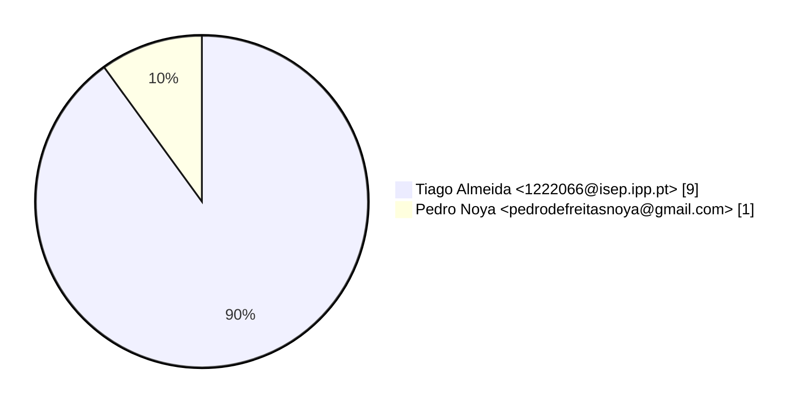
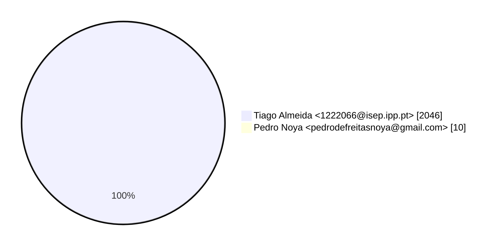
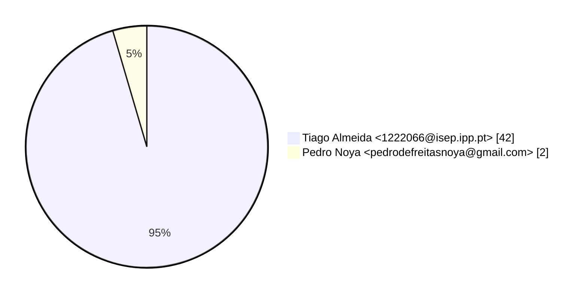

# Contribution stats by author 
|author|insertions|insertions_per|deletions|deletions_per|files|files_per|commits|commits_per|lines_changed|lines_changed_per|
|---|---|---|---|---|---|---|---|---|---|---|
| Tiago Almeida <1222066@isep.ipp.pt>|730|99%|1316|100%|42|95%|9|90%|2046|100%|
| Pedro Noya <pedrodefreitasnoya@gmail.com>|6|1%|4|0%|2|5%|1|10%|10|0%|

## Commits percentage

## Lines changed

## Files changed

