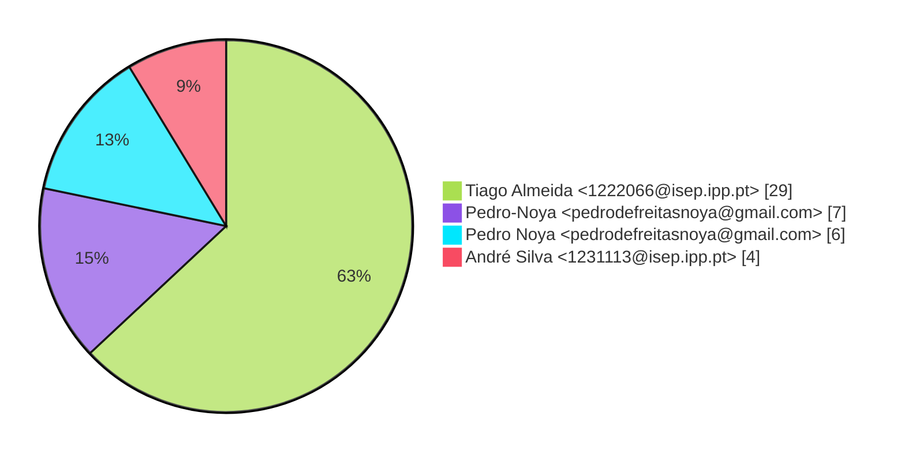
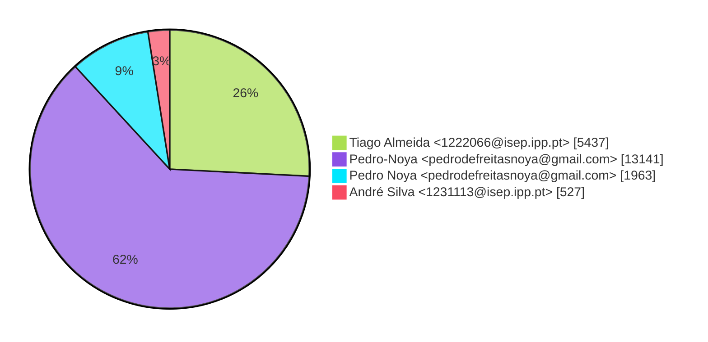
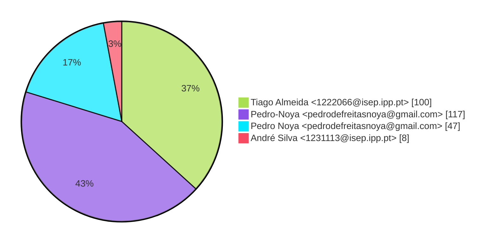

# Contribution stats by author 
|author|insertions|insertions_per|deletions|deletions_per|files|files_per|commits|commits_per|lines_changed|lines_changed_per|
|---|---|---|---|---|---|---|---|---|---|---|
| Tiago Almeida <1222066@isep.ipp.pt>|2303|14%|3134|67%|100|37%|29|63%|5437|26%|
| Pedro-Noya <pedrodefreitasnoya@gmail.com>|12785|78%|356|8%|117|43%|7|15%|13141|62%|
| Pedro Noya <pedrodefreitasnoya@gmail.com>|897|5%|1066|23%|47|17%|6|13%|1963|9%|
| André Silva <1231113@isep.ipp.pt>|397|2%|130|3%|8|3%|4|9%|527|3%|

## Commits percentage

## Lines changed

## Files changed

