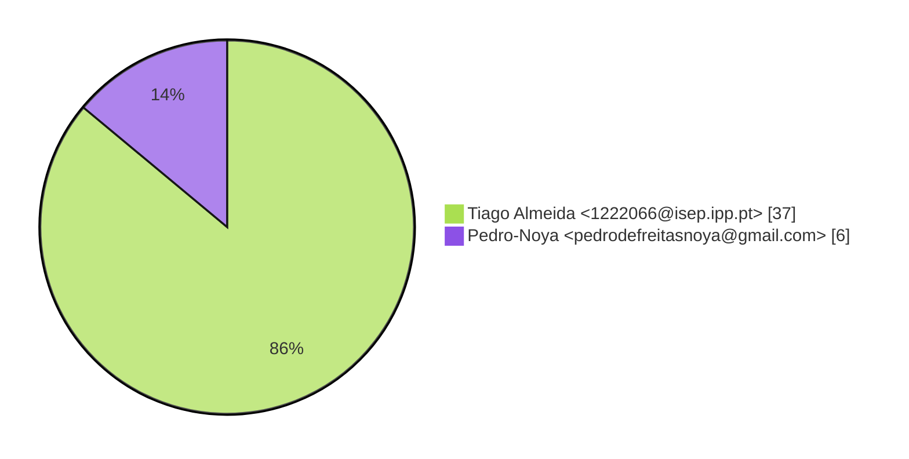
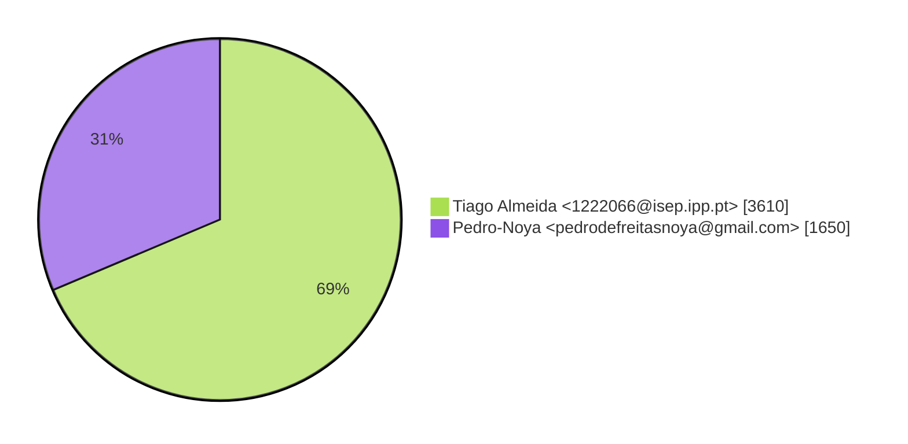
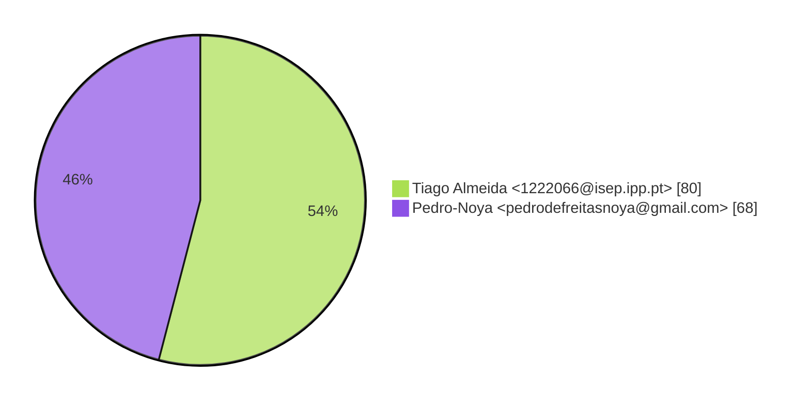

# Contribution stats by author 
|author|insertions|insertions_per|deletions|deletions_per|files|files_per|commits|commits_per|lines_changed|lines_changed_per|
|---|---|---|---|---|---|---|---|---|---|---|
| Tiago Almeida <1222066@isep.ipp.pt>|2667|69%|943|67%|80|54%|37|86%|3610|69%|
| Pedro-Noya <pedrodefreitasnoya@gmail.com>|1183|31%|467|33%|68|46%|6|14%|1650|31%|

## Commits percentage

## Lines changed

## Files changed

